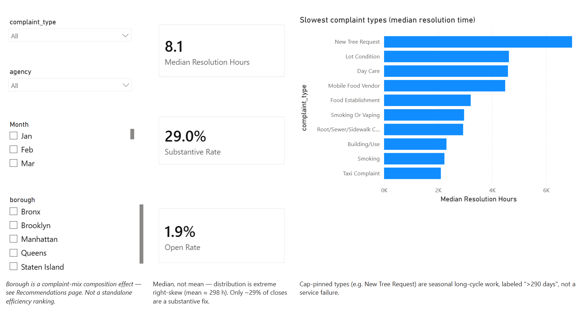
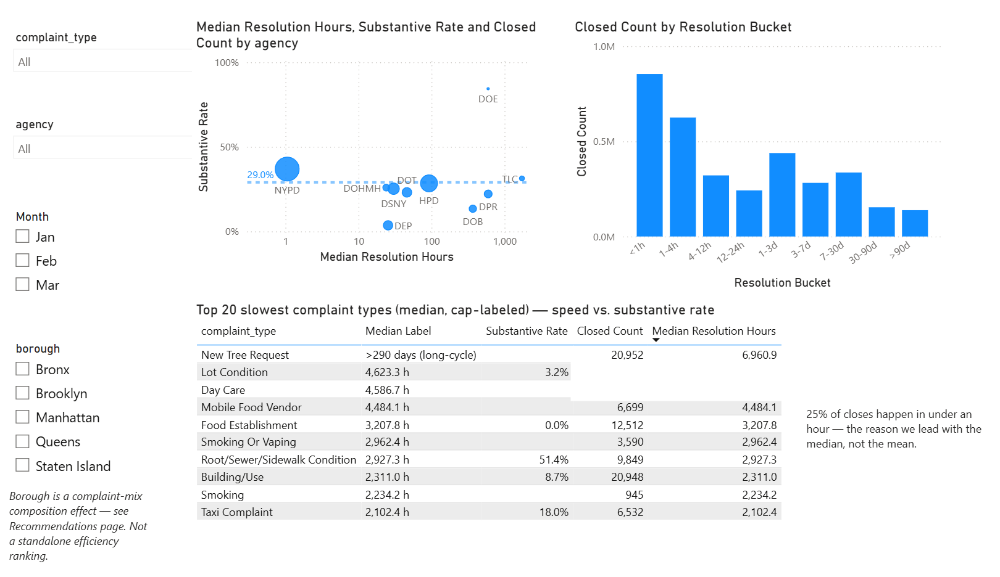
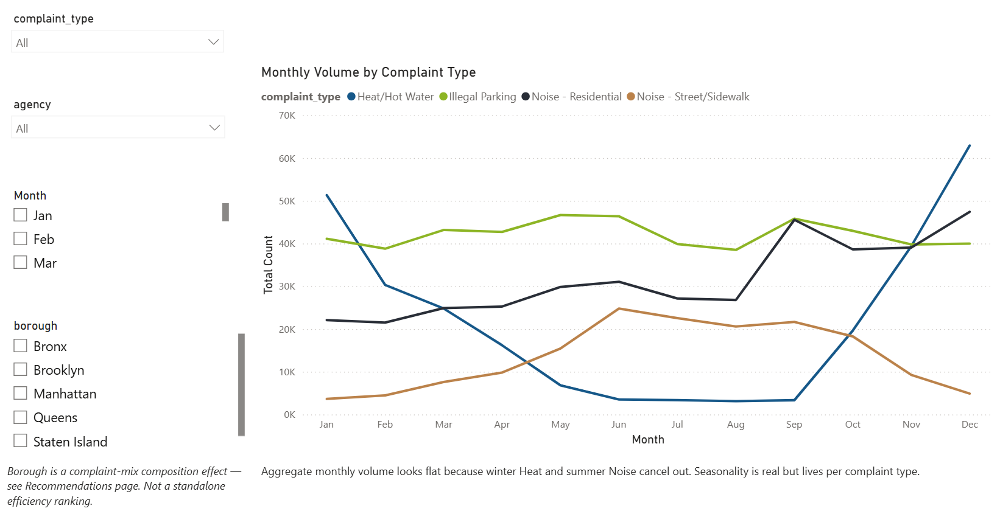
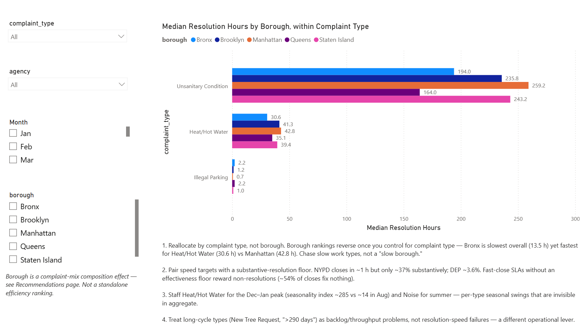

# NYC 311 Service Request Analytics (2024)

End-to-end data-analyst project on **3.46 million** NYC 311 service requests, built to answer one
operational question:

> **Which complaint types and boroughs had the slowest resolution times in 2024, and how should
> the city reallocate response resources?**

### The trend → the recommendation

> **Trend captured:** NYC closes 311 complaints *fast* — half within ~8 hours, a quarter within
> the hour — but fast isn't the same as fixed. Only **29%** of closed complaints were actually
> fixed; **over half (~54%)** closed with no fix at all (nothing found, no access, or passed to
> another office).
>
> **Recommendation:** judge agencies on **how often they actually fix the problem**, not how fast
> they close the ticket — starting with the fast-but-rarely-fixing ones (**DEP closes in ~25 h but
> fixes only 3.6%**).
>
> *(It also corrects the brief's borough angle: no borough is really "slowest" — rankings flip once
> you compare the same complaint type — so the lever is complaint type, not geography.)*

**[Dashboard](#dashboard)** · **[Full findings & recommendations](report/findings_summary.md)** · **[Methodology & decision log](report/analysis_decisions.md)**

**Built with:** Python 3.11 · pandas · NumPy · PyArrow (Parquet) · SQLite (`sqlite3`) · Power BI Desktop (DAX) · Jupyter · Socrata Open Data API

---

## Key findings

| Finding | Evidence |
|---|---|
| **Lead with the median — the mean lies.** | Resolution time is extreme right-skewed: **median 8.1 h** vs mean ≈ 298 h. 25% of tickets close in **under an hour**. |
| **Fast ≠ fixed.** | Only **29%** of closed complaints were actually fixed; **~54%** closed with no fix — *nothing found*, *no access*, or *passed along*. |
| **The agency contrast is the story.** | **NYPD** ~1 h / 37% substantive (1.5M tickets); **DEP** ~25 h / **3.6%**; **DOE** ~596 h / **84%**. Fast ≠ effective. |
| **Borough ranking is misleading.** | It's really the *mix* of complaints: the Bronx is slowest *overall* (13.5 h) yet **fastest** for Heat/Hot Water (30.6 h vs Manhattan 42.8 h). |
| **Seasonality is per-type, invisible in aggregate.** | Heat/Hot Water: **~63K complaints in Dec vs ~3K in Aug**; street noise peaks in June. They cancel out in the total. |

These feed **two primary recommendations** — *measure substantive resolution* and *allocate by complaint-type pipeline* — plus supporting operational levers, in **[`report/findings_summary.md`](report/findings_summary.md)**.

---

## Dashboard

A 4-page Power BI report (`powerbi/nyc_311_dashboard.pbix`), median-first throughout, every speed
figure paired with effectiveness, borough shown only as a caveated within-type drill-down.

**1 · Executive** — headline KPIs + the slowest complaint types


**2 · Resolution Deep Dive** — *speed vs effectiveness* (log-scale agency scatter), the distribution, and the cap-labeled ranking


**3 · Trends** — per-complaint-type seasonality (the winter-Heat / summer-Noise crossover)


**4 · Recommendations** — the borough composition reversal + resourcing recommendations


---

## Methodology

A reproducible pipeline, raw → cleaned → analyzed → reported. The deliverable is judged on
**documented reasoning**, so every cleaning and analysis judgment is written down (see the
[decision log](report/analysis_decisions.md)).

1. **Clean & explore** — [`notebooks/01_cleaning_eda.ipynb`](notebooks/01_cleaning_eda.ipynb).
   Reads the ~2 GB raw CSV efficiently (10 of 44 columns, typed at read time); derives
   **`resolution_time_hours`** (`closed_date − created_date`); keeps open tickets (keyed on the
   *null close date*, not the status string); drops 988 negative durations; winsorizes the tail at
   the 99th percentile (≈290 days); and derives a **`resolution_category`** (Action/Enforcement,
   No issue found, Gone/No access, Referred/Info, …) from agency response templates so *speed* can
   be separated from *effectiveness*. Output: `data/311_cleaned_2024.parquet`.
2. **SQL** — [`sql/`](sql/): the cleaned Parquet loaded into SQLite, one commented `.sql` file per
   business question (median by type, speed-vs-effectiveness by agency, seasonality, open rate,
   distribution, borough-within-type). Demonstrates `JOIN`, `GROUP BY`, window functions, and CTEs.
   These queries are the **acceptance oracle** for the dashboard.
3. **Power BI** — [`powerbi/`](powerbi/): the row-level Parquet loaded into one model with DAX
   measures. **Every measure was verified against the SQL oracle** before building visuals — the
   model reference and the page-by-page build guide are in [`powerbi/README.md`](powerbi/README.md).
4. **Report** — [`report/findings_summary.md`](report/findings_summary.md): plain-English
   recommendations, each backed by a specific number.

### Two framing rules driving every visual

- **Median-first.** The distribution is extreme right-skewed, so the median is the honest
  "typical" value; the mean is reported only with the skew caveat.
- **Speed ≠ effectiveness.** Every resolution-time figure sits next to the substantive-resolution
  rate, because ~54% of closes fix nothing.

---

## Project structure

```
analysis/
├── notebooks/01_cleaning_eda.ipynb   raw → cleaned (documented, runs top-to-bottom)
├── data/
│   ├── 311_cleaned_2024.parquet      committed source of truth (~80 MB, zstd)
│   └── data_dictionary.md            44-col raw reference + cleaned schema
├── sql/                              loader + 6 commented .sql files (+ README)
├── powerbi/
│   ├── nyc_311_dashboard.pbix        4-page dashboard (lean 6-column model)
│   └── README.md                     model reference + page-by-page build guide
├── report/
│   ├── findings_summary.md           recommendations (start here)
│   └── analysis_decisions.md         full reasoning / decision log
├── outputs/                          dashboard screenshots
└── setup.py                          re-downloads the raw data (Socrata erm2-nwe9)
```

> The ~2 GB raw CSV and the ~1 GB cleaned CSV are git-ignored (GitHub's 100 MB limit); **Parquet
> is the committed form**. Re-create the raw data with `python setup.py` if needed.

## Reproduce

```powershell
$py = ".\.venv\Scripts\python.exe"
& $py -m pip install -r requirements.txt          # install pinned deps

# Re-run cleaning end-to-end (raw -> parquet)
& $py -m jupyter nbconvert --to notebook --execute --inplace `
  --ExecutePreprocessor.kernel_name=nyc311 notebooks/01_cleaning_eda.ipynb

# Build the SQL DB and run any query
& $py sql\00_load_to_sqlite.py
& $py sql\run_query.py sql\01_median_by_complaint_type.sql
```

Then open `powerbi/nyc_311_dashboard.pbix` in Power BI Desktop (connected to the committed Parquet).

## Data source

NYC Open Data — [311 Service Requests](https://data.cityofnewyork.us/Social-Services/311-Service-Requests-from-2010-to-Present/erm2-nwe9)
(Socrata resource `erm2-nwe9`), filtered to calendar year 2024: **3,456,770 raw rows → 3,455,782
cleaned**.

---

<sub>Portfolio project. Repo: `https://github.com/<your-username>/nyc-311-analytics` *(replace with your URL)*.</sub>
